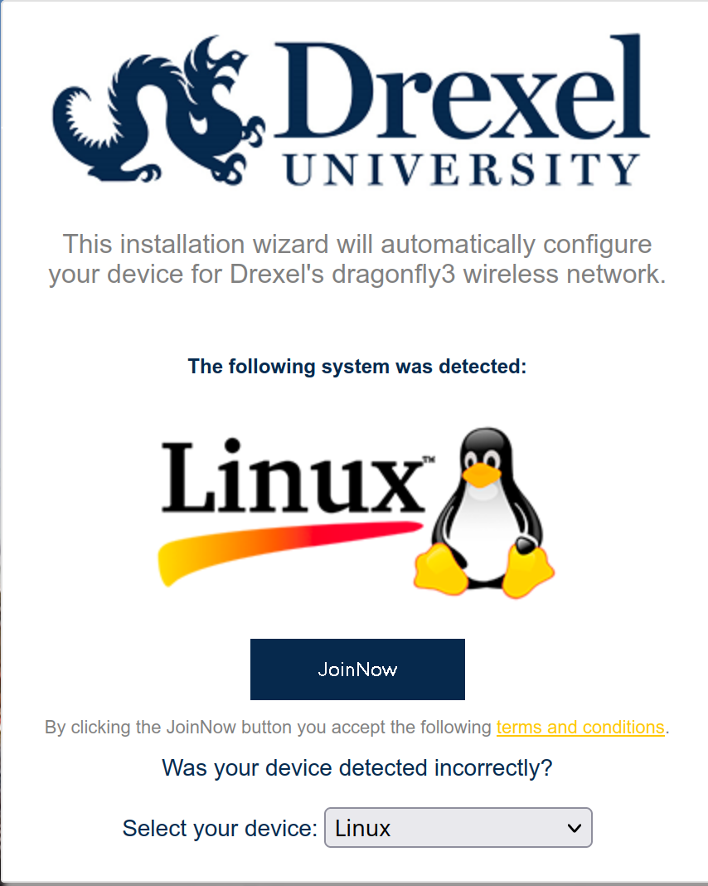
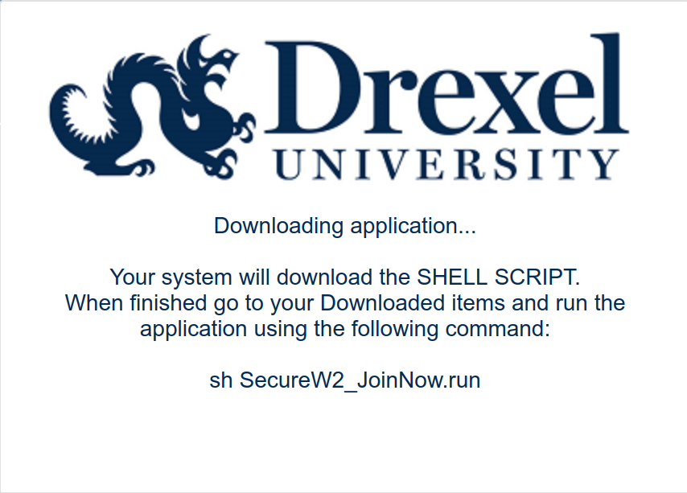
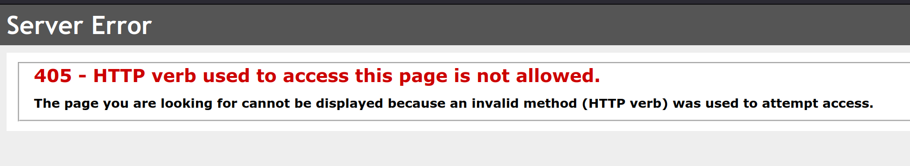

# Dragonfly 3 NetworkManager Linux Autoconnect 

# Contact
The goal of this is to be supported as long as I am enrolled in the university so 
please let me know if you have any problems.

Discord: @shahriyarshawon 

Email: shs96@drexel.edu

# Prequisites
- Using some form of Linux
- Using NetworkManager to manage networks 
- bash, curl

# Quick Start
```sh 
curl -O https://raw.githubusercontent.com/ShahriyarShawon/dragonfly3_linux_autoconnect/master/dragonfly3_networkmanager_autoscript.sh
sh dragonfly3_networkmanager_autoscript.sh
# That's It
```

# Implementation Details

This is all an automation of the instructions posted [here](https://drexel.edu/it/help/a-z/dragonfly3/generic_config/)

## Background
This script uses nmcli to add a net .nmconnection so that NetworkManager has a 
profile of the dragonfly3 network to connect to.

An .nmconnection file stores all the necessary information required to connect to 
a network. They are stored in plaintext in `/etc/NetworkManager/system-connections/`.
You can see all the saved profiles you have with 
`ls -l /etc/NetworkManager/system-connections/`. 

While I don't think directly adding your own .nmconnection file would work 
(there's probably some hidden logic I was missing), nmcli essentially just formats
your inputs and outputs a file like this 
```
[connection]
id=dragonfly3
uuid=ebbc6f40-64ff-4b86-b481-ced236c94c64
type=wifi
interface-name={YOUR WIFI? INTERFACE}

[wifi]
mode=infrastructure
ssid=dragonfly3

[wifi-security]
key-mgmt=wpa-eap

[802-1x]
ca-cert={LOCATION OF YOUR CA CERT}
eap=peap;
identity={YOUR ABC123}
password={YOUR PASSWORD}
phase2-auth=mschapv2

[ipv4]
method=auto

[ipv6]
addr-gen-mode=stable-privacy
method=auto

[proxy]
```
To connect to the dragonfly3 network you need to provide a certificate which is 
hosted [here](https://comodoca.my.salesforce.com/sfc/p/1N000002Ljih/a/3l000000VZ4M/ie5Sho19m8SLjTZkH_VL8efOD1qyGFt9h5Ju1ddtbKQ) but the actual download link to the crt is 
[here](https://comodoca.file.force.com/sfc/dist/version/download/?oid=00D1N000002Ljih&ids=0683l00000ENwaHAAT&d=%2Fa%2F3l000000VZ4M%2Fie5Sho19m8SLjTZkH_VL8efOD1qyGFt9h5Ju1ddtbKQ&operationContext=DELIVERY&viewId=05H5c000000jDrXEAU&dpt=)


## Script Implementation
This script uses `/home/{username}/config/dragonfly` to store the `dragonfly3.crt` 
certificate. 

The a high level explanation of the most important steps is 
1. See if config directory exists, if not then create it 
2. Download the cert and rename it to dragonfly3.crt
3. Move it to the config directory 
4. ask for drexel username and password 
5. run nmcli command with all the provided inputs

# Why I made this 
I use Linux as my daily and only os. Drexel's says that it provide an auto script 
for connecting from Linux machines but every attempt I've made has resulted in 
failure.

On Initial Inspection, it seems like Linux would be well supported


But On further inspection (a singular click) we can see that it wants to download 
something.


And then ultimately fails and throws a 405


Every Time I've had to connect I've had to use 
[this page](https://drexel.edu/it/help/a-z/dragonfly3/generic_config/) 
and I thought that having and automatic script would be nice to have.
